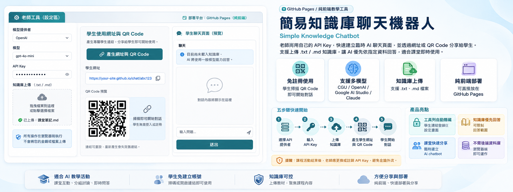

# Simple Knowledge Chatbot



一個可以部署在 GitHub Pages 的純前端 AI 聊天機器人。老師可以使用自己的 CGU、OpenAI、Google AI Studio 或 Claude API Key，快速建立臨時 AI 聊天頁面，也可以上傳 `.txt` 或 `.md` 知識庫，讓 AI 優先根據指定資料回答。

## 使用情境

老師在課堂中導入 AI 工具時，學生可能沒有可用的帳號或電子信箱，無法自行註冊相關服務。

透過這款簡易 ChatBot，老師可以串接自己的 Google AI Studio、OpenAI、Claude 等模型 API Key，快速建立一個臨時 AI 聊天機器人，並產生專屬網址與 QR Code。學生只要掃描 QR Code，就能直接使用 AI，不需要另外註冊帳號或輸入個人資料，讓 AI 教學活動更容易在課堂中進行。

安全提醒：課程活動結束後，老師應立即更換或註銷本次使用的 API Key，避免金鑰外流、遭他人未授權使用，或產生額外費用。

可直接使用的網址：[https://educatres.github.io/simpleKnowledgeChatbot/](https://educatres.github.io/simpleKnowledgeChatbot/)

需要 Google API Key 的老師，可搜尋：[如何申請 Google AI Studio API Key](https://www.google.com/search?q=%E5%A6%82%E4%BD%95%E7%94%B3%E8%AB%8B%20Google%20AI%20Studio%20API%20Key)

## 功能特色

- 純前端設計，不需要後端伺服器或資料庫。
- 可直接部署到 GitHub Pages。
- 支援 CGU、OpenAI、Google AI Studio、Claude API。
- 可使用預設模型，也可輸入自訂模型名稱。
- 支援串流輸出；若 API 回傳不支援串流，會改用逐字動畫顯示回答。
- 可上傳 `.txt` 或 `.md` 知識庫檔案。
- 知識庫只在瀏覽器端讀取與切段，不會上傳到網站伺服器。
- 可選擇「優先根據知識庫」或「嚴格限制在知識庫範圍內回答」。
- 可在工具區依目前參數產生學生網址與 QR Code。
- 如果網址帶入 API Key，工具列會自動鎖住並隱藏，避免學生看到或修改設定。
- 知識庫設定預設隱藏，需要時再展開。

## 基本使用方式

1. 開啟網頁。
2. 點選「顯示工具」打開設定區。
3. 在「API 設定」選擇 API 提供者。
4. 輸入 API Key。
5. 選擇預設模型，或在「自訂模型」輸入模型名稱。
6. 依需要填寫 system prompt（系統提示）。
7. 按下「產生網址與 QR Code」，系統會自動建立學生使用的連結與 QR Code。
8. 將網址或 QR Code 分享給學生。
9. 若老師本人要使用知識庫，可另外上傳 `.txt` 或 `.md` 檔案後開始對話。

> 由於網址有長度限制，產生的學生連結只會帶入 system prompt（系統提示），不會包含老師自行上傳的知識庫。學生開啟連結後，無法使用老師本機上傳的知識庫內容。

## API 提供者

目前支援以下 `provider`：

```text
cgu
openai
google
claude
```

對應說明：

| provider | 說明 | 預設 Endpoint |
| --- | --- | --- |
| `cgu` | CGU API Key | `https://air.cgu.edu.tw/cgullmapi/v1` |
| `openai` | OpenAI API Key | `https://api.openai.com/v1` |
| `google` | Google AI Studio API Key | `https://generativelanguage.googleapis.com/v1beta` |
| `claude` | Claude API Key | `https://api.anthropic.com/v1` |

## 給學生使用的連結

老師完成 API 提供者、API Key、模型與 system prompt（系統提示）設定後，只要按下「產生網址與 QR Code」，網頁就會自動建立學生使用的連結與 QR Code，不需要手動編輯網址。

學生開啟產生的連結後，網頁會自動：

- 讀入 API Key。
- 讀入指定 provider 與 model。
- 隱藏工具列。
- 隱藏「顯示工具」按鈕。
- 不讓學生打開 API 設定畫面。

這可以降低學生看到或修改 API Key 的機會。不過 API Key 仍然存在於網址中，因此這不是長期公開使用的安全方案。

由於網址有長度限制，學生連結只支援傳遞 system prompt（系統提示），無法包含老師自行上傳的知識庫。若學生需要使用相同知識庫，必須在自己的瀏覽器中另外上傳檔案。

## 知識庫功能

本工具支援上傳純文字知識庫：

```text
.txt
.md
```

使用方式：

1. 打開工具列。
2. 在「知識庫」區塊選擇 `.txt` 或 `.md` 檔案。
3. 網頁會在瀏覽器中讀取檔案並切成多個片段。
4. 提問時，系統會先找出與問題相關的片段。
5. AI 會優先根據這些片段回答。

注意事項：

- 知識庫檔案不會儲存到 GitHub。
- 知識庫檔案不會上傳到本網站伺服器。
- 知識庫只存在於目前使用者的瀏覽器中，無法透過自動產生的網址或 QR Code 傳給學生的 Chatbot。
- 送出問題時，相關知識片段會連同問題一起送到你選擇的 AI API。
- 請勿上傳高度敏感、個資、機密或不應提供給第三方 AI 服務的資料。

## 回答模式

可選擇兩種回答模式：

| 模式 | 說明 |
| --- | --- |
| 優先根據知識庫，必要時可用模型補充 | 知識庫不足時，模型可以用一般知識補充。 |
| 嚴格限制在知識庫範圍內回答 | 知識庫沒有答案時，模型應回答無法確認。 |

## 安全提醒

這個工具適合課堂、工作坊、短期測試或臨時展示。若把 API Key 放在網址中，請務必注意：

- 網址可能留在瀏覽器歷史紀錄。
- 網址可能出現在截圖、投影片、QR Code 或分享紀錄中。
- 學生或其他使用者可能複製完整網址。
- API Key 若未限制額度或權限，可能產生額外費用。

建議：

- 使用專門為課堂建立的臨時 API Key。
- 設定 API 使用額度或費用上限。
- 課程結束後立即更換或註銷 API Key。
- 不要把長期使用或高權限 API Key 放入網址。

## 本機開發

這是純 HTML、CSS、JavaScript 專案，不需要安裝套件。

可以直接打開：

```text
index.html
```

或使用任何靜態伺服器，例如：

```bash
python3 -m http.server 8000
```

再開啟：

```text
http://localhost:8000
```

## 部署到 GitHub Pages

1. 將專案推送到 GitHub repository。
2. 到 GitHub repository 的 Settings。
3. 進入 Pages。
4. Source 選擇 `Deploy from a branch`。
5. Branch 選擇 `main`，資料夾選擇 `/root`。
6. 儲存後等待 GitHub Pages 部署完成。

## 專案檔案

| 檔案 | 用途 |
| --- | --- |
| `index.html` | 網頁結構 |
| `styles.css` | 版面與樣式 |
| `app.js` | 聊天、API 呼叫、知識庫與網址參數邏輯 |
| `README.md` | 使用說明 |

## License

本專案採用 MIT License。
